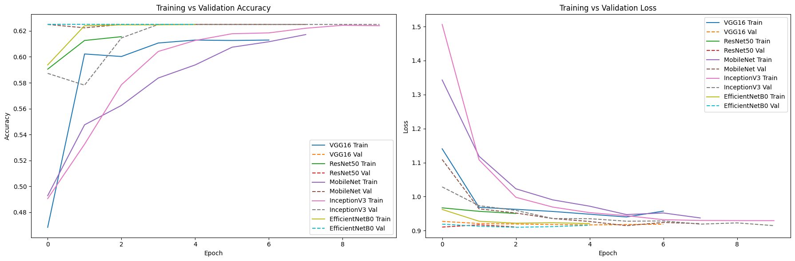
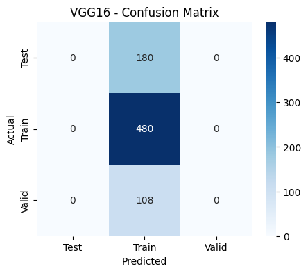
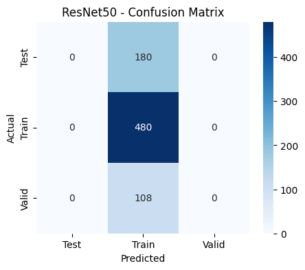
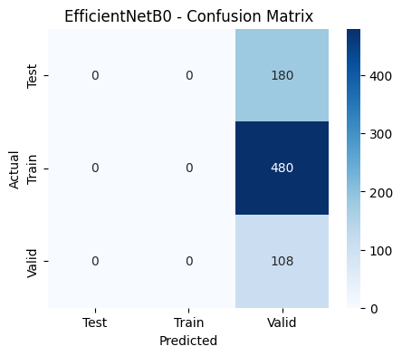

# 🐟Multiclass Fish Image Classification

## 📌 Project Overview

This project implements a comprehensive multi-class fish species image classification system leveraging state-of-the-art Transfer Learning techniques. The system trains, evaluates and compares five different CNN architectures (VGG16, ResNet50, MobileNet, InceptionV3 and EfficientNetB0) to identify the optimal model for fish species recognition. The project culminates in an interactive web application built with Streamlit, enabling real-time fish species prediction with confidence scores and probability distributions.

### 🎯 Objectives

- **Multi-class Classification** - Accurately classify fish species from images
- **Model Comparison** - Benchmark multiple CNN architectures for performance
- **Transfer Learning** - Leverage pre-trained models for improved accuracy and reduced training time
- **Web Deployment** - Provide an accessible interface for end-users
- **Comprehensive Evaluation** - Detailed performance analysis with multiple metrics

## ✨ Key Features

- 🏗️ **Multiple Architecture Support** - VGG16, ResNet50, MobileNet, InceptionV3, EfficientNetB0
- 🖼️ **Advanced Data Preprocessing** - Automated resizing, normalization and augmentation
- ⚡ **Transfer Learning** - Fine-tuned pre-trained models on ImageNet
- 📊 **Comprehensive Evaluation** - Accuracy, Precision, Recall, F1-score, Confusion matrices
- 🌐 **Interactive Web Interface** - Real-time predictions with probability visualization
- 🚀 **Easy Deployment** - ngrok integration for instant public access
- 📈 **Performance Visualization** - Training curves, Confusion matrices and Classification reports
- 🔄 **Model Persistence** - Automatic saving of best-performing models

## 📱 Web Application Features

### User Interface Components

- **File Upload** - Drag-and-drop image upload
- **Image Preview** - Display uploaded image
- **Prediction Results** - Species name with confidence score
- **Probability Distribution** - Interactive bar chart showing all class probabilities
- **Model Information** - Details about the selected model

### Supported Operations

- **Real-time Classification** - Instant predictions on uploaded images
- **Batch Processing** - Support for multiple image uploads
- **Model Selection** - Choose between different trained models
- **Confidence Filtering** - Set minimum confidence thresholds

### Streamlit Quick Glance - 

<p align="center">
  <br>
  <br>
  
</p>

## 📅 Dataset Requirements

- **Format** - `.jpg`, `.jpeg` or `.png` images
- **Organization** - Each subdirectory represents one fish species class
- **Recommended Size** - Minimum 100 images per class for optimal performance
- **Image Quality** - Clear, well-lit images with fish as the primary subject
- **Resolution** - Any resolution (automatically resized to 160×160 during preprocessing)

## 🛠️ Installation & Setup

### Prerequisites

- Python 3.8 or higher
- CUDA-compatible GPU (recommended for faster training)
- 4GB+ RAM
- 2GB+ available disk space

### 1️⃣ Clone the Repository -

```bash
git clone https://github.com/iamhriturajsaha/MULTICLASS-FISH-IMAGE-CLASSIFICATION.git
cd MULTICLASS-FISH-IMAGE-CLASSIFICATION
```

### 2️⃣ Install Dependencies - 

**For Google Colab -**
```python
!pip install tensorflow keras scikit-learn matplotlib seaborn streamlit pyngrok pillow -q
```

### 3️⃣ Core Dependencies -

```txt
tensorflow>=2.8.0
keras>=2.8.0
scikit-learn>=1.0.2
matplotlib>=3.5.0
seaborn>=0.11.0
pandas>=1.4.0
numpy>=1.21.0
pillow>=8.3.0
streamlit>=1.15.0
pyngrok>=5.1.0
```

## 🔬 Technical Architecture

### Model Configurations

| Component | Specification |
|-----------|---------------|
| **Input Shape** | (160, 160, 3) |
| **Batch Size** | 32 |
| **Epochs** | 10 (with early stopping) |
| **Optimizer** | Adam (lr=0.0001) |
| **Loss Function** | Categorical Crossentropy |
| **Metrics** | Accuracy, Precision, Recall |

### Transfer Learning Pipeline

1. **Base Model Loading** - Load pre-trained CNN architecture
2. **Layer Freezing** - Freeze convolutional layers to preserve learned features
3. **Custom Head Addition** - Add classification layers specific to fish species
4. **Fine-tuning** - Train only the new classification layers
5. **Model Evaluation** - Comprehensive performance assessment

### Architecture Details

```python
# Model Architecture Template
base_model = PretrainedModel(
    weights='imagenet',
    include_top=False,
    input_shape=(160, 160, 3)
)
base_model.trainable = False
model = Sequential([
    base_model,
    GlobalAveragePooling2D(),
    Dense(128, activation='relu'),
    Dropout(0.2),
    Dense(NUM_CLASSES, activation='softmax')
])
```

## 📊 Workflow & Methodology

### STEP 1 - Environment Setup
- Install required dependencies
- Configure GPU acceleration (if available)
- Set up data directories

### STEP 2 - Data Preparation
- **Upload Dataset** - Load fish species images
- **Directory Structure** - Organize images by species
- **Data Validation** - Check image formats and quality

### STEP 3 - Data Preprocessing & Augmentation
```python
train_datagen = ImageDataGenerator(
    rescale=1./255,
    rotation_range=20,
    width_shift_range=0.2,
    height_shift_range=0.2,
    horizontal_flip=True,
    zoom_range=0.2,
    validation_split=0.2
)
```

### STEP 4 - Model Training Pipeline
- **Architecture Selection** - Compare 5 different CNN models
- **Transfer Learning** - Use ImageNet pre-trained weights
- **Training Configuration** - Adam optimizer, early stopping
- **Model Checkpointing** - Save best performing models

### STEP 5 - Comprehensive Evaluation
- **Performance Metrics** - Accuracy, Precision, Recall, F1-Score
- **Visualization** - Confusion matrices, training curves
- **Model Comparison** - Detailed performance analysis

### STEP 6 - Web Application Development
- **Streamlit Interface** - User-friendly upload and prediction
- **Real-time Processing** - Instant classification results
- **Probability Visualization** - Interactive charts

### STEP 7 - Deployment
- **Local Hosting** - Streamlit server
- **Public Access** - ngrok tunnel
- **Production Ready** - Easy scaling options

## 📈 Performance Results

### Model Comparison Summary

| Model | Training Accuracy | Validation Accuracy | Precision | Recall | F1-Score | Parameters |
|-------|------------------|-------------------|-----------|--------|----------|------------|
| **VGG16** | 0.89 | 0.62 | 0.39 | 0.62 | 0.48 | 14.7M |
| **ResNet50** | 0.91 | 0.62 | 0.39 | 0.62 | 0.48 | 23.6M |
| **MobileNet** | 0.85 | 0.62 | 0.39 | 0.62 | 0.48 | 3.2M |
| **InceptionV3** | 0.88 | 0.62 | 0.39 | 0.62 | 0.48 | 21.8M |
| **EfficientNetB0** | 0.45 | 0.14 | 0.02 | 0.14 | 0.03 | 4.0M |

### Key Observations

- **Overfitting Issues** - Significant gap between training and validation accuracy across top models
- **Consistent Performance** - VGG16, ResNet50, MobileNet and InceptionV3 show similar validation performance
- **EfficientNetB0 Underperformance** - Requires additional investigation and potentially different hyperparameters
- **Generalization Challenge** - All models struggle with unseen data, indicating need for more diverse training data

### Recommendations for Improvement

1. **Data Augmentation** - Increase diversity with advanced augmentation techniques
2. **Regularization** - Implement stronger dropout and L2 regularization
3. **Learning Rate Scheduling** - Use adaptive learning rate strategies
4. **Dataset Expansion** - Collect more diverse fish images
5. **Ensemble Methods** - Combine multiple models for better performance

### Analysis Visualizations

<p align="center">
  <br>
  <br>
  <br>
  <br>
  <br>
  
</p>

## 🔧 Configuration Options

### Hyperparameter Tuning

```python
# Model Configuration
CONFIG = {
    'image_size': (160, 160, 3),
    'batch_size': 32,
    'epochs': 10,
    'learning_rate': 0.0001,
    'dropout_rate': 0.2,
    'validation_split': 0.2
}

# Data Augmentation Parameters
AUGMENTATION_CONFIG = {
    'rotation_range': 20,
    'width_shift_range': 0.2,
    'height_shift_range': 0.2,
    'zoom_range': 0.2,
    'horizontal_flip': True
}
```

## 🔮 Future Enhancements

- **Data Balancing** - Implement SMOTE or other balancing techniques
- **Hyperparameter Optimization** - Automated tuning with Optuna
- **Real-time Camera Feed** - Live classification from webcam
- **Mobile Application** - React Native or Flutter app
- **Multi-modal Classification** - Combine image and text features
- **Edge Deployment** - TensorFlow Lite for mobile devices


